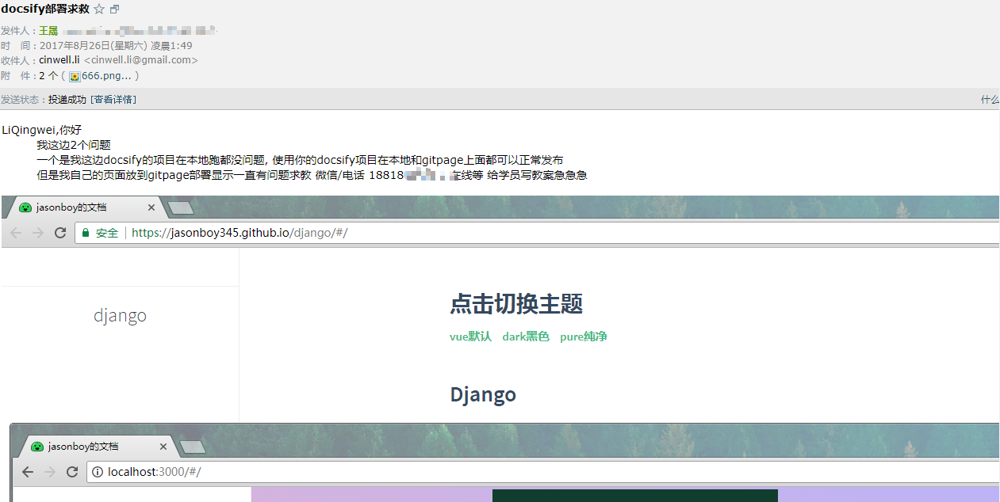
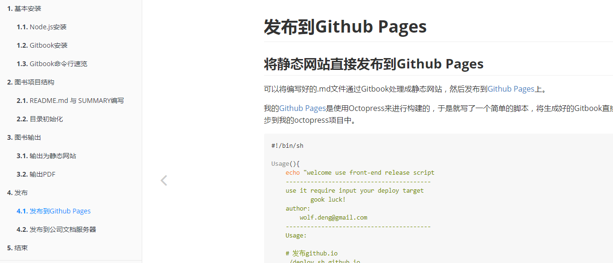
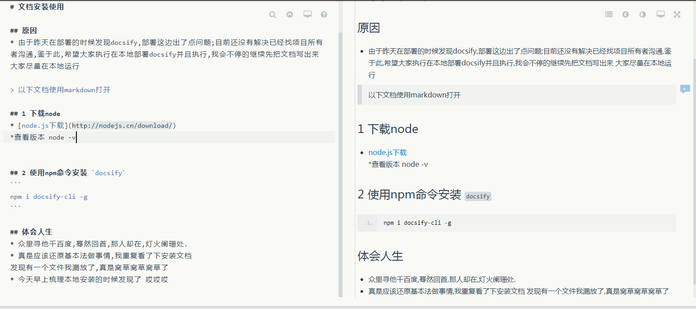
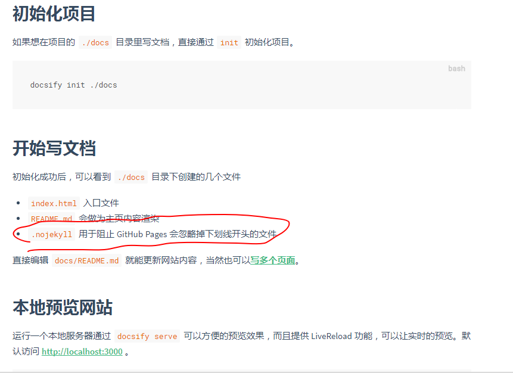
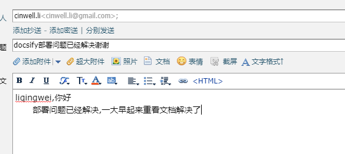

# 部署中发生的故事

## 我遇到了一个bug 
* django基础整理完到11点,部署发布到gitpage;结果到凌晨3点都没发解决;
* 不段的尝试,部署安装删除仓库,再部署在安装在删除仓库,用别人的代码部署没问题,自己的代码几乎一样出问题,开始怀疑人生,怀疑这个文档工具
* 我给作者写邮件

* 没有人回复,立刻找替代方案 准备尝试gitbook 甚至是jeklly准备自己搭建博客了

* 甚至发了朋友圈 

## 在满脑子一堆bug的情况下,遗憾的睡下去

## 第二天为了快速将文档内容得以呈现
* 准备上替补方案让学员使用本地环境搭建,梳理本地环境,编写搭建文档

* 回看官方文档 梳理本地部署步骤,居然解决了

* 给作者回复解决了

## 得出的总结

> __体会人生__ 

> 众里寻他千百度,蓦然回首,那人却在,灯火阑珊处.

> 真是应该还原基本法做事情

