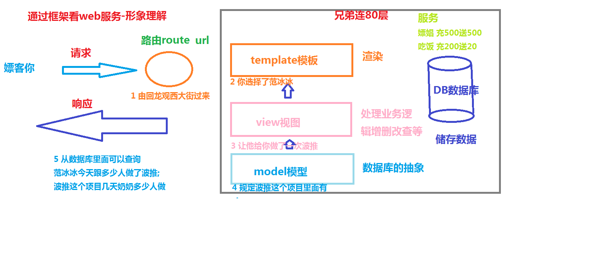

# web组成

# 那么我们认识下python-django框架

## 抽象理解
* 抽象的说目前web开发就是 
* web服务走的是`http`协议 
* `http`协议特点 `端口80,无状态`
* web服务核心: __请求__和__响应__
* 用户__请求__web`服务`,然后服务器端web服务器__响应__用户请求的过程
* django框架中用户请求走`路由`

### Django-MTV介绍route+MTV
> `route` 处理url请求
`view` (做业务逻辑处理)
`template` (模板其实就是页面渲染)
`model` (模型)

### 看图

> 抽象你抽象不来,那就来形象的

## 形象理解
* `route路由`就是一个路 你是由那条路过来 想享受什么`web服务`
* `route` 你由回龙观东大街过来
* `http`协议特点:你在兄弟连大厦`80层`提供嫖娼服务;`无状态`你嫖过的妹子,每天要接待大量的嫖客,为了提供更好的服务来了就是干,干完根本记不住你是谁,记不住你的状态
* 希望到兄弟连找一些`服务`比如 嫖娼啊 比如 吃饭啊;是嫖娼还是吃饭 就是`app功能模块`
* `view视图` 在django中叫视图 做业务逻辑的 比如 你想嫖娼 你跟妹子做A套餐(做) 你跟妹子做B套餐(做+吹) 完成实现套餐里面的内容就是视图
*` template 模板`就是你选择跟哪个妹子做 你选妹子可以有标准,你要看脸 看胸 要能吸引你,范冰冰的脸,俞晴的胸,金·卡戴珊的屁股
* `model模型` 就是 确定里面A B套餐里面都有啥 比如 独龙 69 X推 

### 看图

## 最后看合成的

## 总结
> 计算机需要大家有抽象思维去理解

> 如果抽象理解不了那就用你熟悉的形象化思维去理解抽象的东西

> 冰冰姐好忙