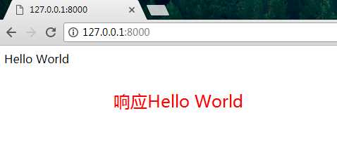

# Hello World跑起来

## django下载
```
pip install django
```
## Hello World跑起来
> 使用Django快速搭建一个web服务

1 新建demo目录,进入demo目录
```
mkdir demo
cd demo
```

2 demo目录中,创建项目helloworld
```
django-admin startproject helloworld
cd helloworld
```

3 项目helloworld中创建一个app,名为newapp
查看目录
```
python manage.py startapp newapp
dir(or ls)
```

4 看下项目目录结构 `tree /F(win) | tree (linux)`
```
.
├── newapp
│   ├── admin.py
│   ├── __init__.py
│   ├── migrations
│   │   └── __init__.py
│   ├── models.py
│   ├── tests.py
│   └── views.py
├── helloworld
│   ├── __init__.py
│   ├── __pycache__
│   │   ├── __init__.cpython-36.pyc
│   │   └── settings.cpython-36.pyc
│   ├── settings.py
│   ├── urls.py
│   └── wsgi.py
└── manage.py
```

5 新建的app newapp添加到默认配置中`./helloworld/settings.py`,在`INSTALLED_APPS `数组中添加app newapp
```python
INSTALLED_APPS = (
    'django.contrib.admin',
    'django.contrib.auth',
    'django.contrib.contenttypes',
    'django.contrib.sessions',
    'django.contrib.messages',
    'django.contrib.staticfiles',
    'newapp',
)
```

6 编辑newapp目录中的视图view.py文件
```python
#coding: utf-8
from django.shortcuts import render
# 加入http响应模块
from django.http import HttpResponse
# 定义函数index做响应
def index(request):
    # 响应为字符串Hello World
    return HttpResponse(u'Hello World')
```

7 为刚才的view视图配置url路由,编辑`./helloworld/urls.py`

```python
from django.conf.urls import include, url
from django.contrib import admin
#导入newapp view视图
from newapp import views as newapp_views

urlpatterns = [
    url(r'^admin/', include(admin.site.urls)),
    # 当请求首页时,响应为newapp中的index方法
    url(r'^$', newapp_views.index)
]
```

8 运行web服务器
```
python manage.py runserver 0.0.0.0:8000
```

9 浏览器测试成功




10 回顾操作步骤
```
.
├── newapp   2 创建app
│   ├── admin.py
│   ├── __init__.py
│   ├── migrations
│   │   └── __init__.py
│   ├── models.py
│   ├── tests.py
│   └── views.py 3 修改views.py(导入request模块 写index方法)
├── helloworld  1 创建project
│   ├── __init__.py
│   ├── __pycache__
│   │   ├── __init__.cpython-36.pyc
│   │   └── settings.cpython-36.pyc
│   ├── settings.py 4 配置文件添加app
│   ├── urls.py 5 设置路由(导入view视图,写路由规则)
│   └── wsgi.py
└── manage.py
```


## Django 项目的项目结构。

```
├── Hello
│   ├── admin.py
│   ├── __init__.py
│   ├── migrations
│   │   └── __init__.py
│   ├── models.py
│   ├── tests.py
│   └── views.py
├── HelloWorld
│   ├── __init__.py
│   ├── __pycache__
│   │   ├── __init__.cpython-34.pyc
│   │   └── settings.cpython-34.pyc
│   ├── settings.py
│   ├── urls.py
│   └── wsgi.py
└── manage.py
```
__urls.py__
链接入口，关联到对应的  `views.py` 中的一个函数（或者称作 generic 类），访问的链接就对应一个函数。

__views.py__
处理用户发出的请求，从 `urls.py` 中对应而来，通过渲染 templates 中的网页可以为用户显示页面内容，比如登录后的用户名，用户请求的数据，通过其输出到页面。

__models.py__
与数据库操作相关，存入或读取数据时使用。当不使用数据库的时候，也可以当做一般的类封装文件，存储各种类的定义。

__forms.py__
表单，用户在浏览器上输入提交，对数据的验证工作以及输入框的生成等工作，都依托于此。

__admin.py__
后台文件，可以用少量的代码就拥有一个强大的后台。

__settings.py__
Django 的设置、配置文件，比如 DEBUG 的开关，静态文件的位置等等。

除了这些，还有以上目录中未提及的：

__templates目录__
`views.py` 中的函数渲染 templates 中的 html 模板，得到动态内容的网页，可以用缓存来提高渲染速度。