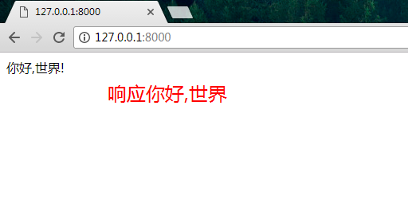

# 视图view和路由route

## 创建项目
1 建立一个新的 Django 项目，并命名为 `mypro01`
```
django-admin.py startproject mypro01
```

2 查看目录结构
```
.
├── mypro01
│   ├── __init__.py
│   ├── settings.py
│   ├── urls.py
│   └── wsgi.py
└── manage.py
```
在新建的 `mypro01` 目录中，其中还有一个 `mypro01` 目录，

* `mypro01` 中的是项目配置 `settings.py` 文件
*  总的路由 `urls.py` 
*  部署服务器时用到的 `wsgi.py` 文件
*  `__init__.py` 是 Python 包的目录结构基础文件，与包的调用有关。


3 在当前的 `mypro01` 目录下，新建一个应用，并命名为 learn。
```
python manage.py startapp learn
```
4 新创建的app的 `learn`目录结构
```
.
├── admin.py
├── __init__.py
├── migrations
│   └── __init__.py
├── models.py
├── tests.py
└── views.py
```
`migrations` 目录用于记录数据库变化日志。

5 新创建的 app 添加到 `settings.py` 中的 `INSTALL_APPS` 中
```python
INSTALLED_APPS = (
    'django.contrib.admin',
    'django.contrib.auth',
    'django.contrib.contenttypes',
    'django.contrib.sessions',
    'django.contrib.messages',
    'django.contrib.staticfiles',
    'learn',
)
```
此步骤的操作含义。将新建的 learn 这个 app 添加至 `INSTALL_APPS` 中，Django 就可以自动的找到 app(这里就是learn) 中的__模板文件__（learn/templates/all_files）。
__第五章模板(template)做介绍__

## 定义视图函数 

6 编辑learn 目录中`views.py`文件：

```python
# 声明文本编码为 utf-8，因为我们在代码中使用了中文。
#coding: utf-8
from django.shortcuts import render
from django.http import HttpResponse


def index(request):
    return HttpResponse(u"你好,世界!")
```
引入 `HttpResponse `，它是用来向网页返回内容的，就像 Python 中的 print 函数一样，只不过`HttpResponse` 是把内容显示到网页上。（其实是对数据的一个传递，HttpResponse在这里就可以简单理解为一个输出函数。）

最后定义了一个 `index()` 函数，第一个参数必须是 `request`，这个与请求有关，`request` 变量里包含了 get 或 post 方式（这是一种 RESTful API 的设计风格，在资源传递方式中还有 _put_、_delete_ 另两种方式，只是之前提到的两个最常用）传递而来的参数。我们可以对这些参数做出定制处理，然后向用户层返回待展示的数据。这里不做复杂的功能，直接返回 `你好,世界!` 这个字符串即可。

## 定义视图相关的 URL，即配置路由
7 进行路由配置。编辑 urls.py 这个文件：
```python
from django.conf.urls import url
from django.contrib import admin
from learn import views as learn_views  # new 导入视图模块


urlpatterns = [
    url(r'^$', learn_views.index),  # new 添加路由规则
    url(r'^admin/', admin.site.urls),
]
```

8 启动djangoweb服务
```
python manage.py runserver 0.0.0.0:8000
```
页面响应结果




## 看图

* 1 请求 
* 2 __路由检查请求指向__ 检查请求是否合法
* 3 __视图处理__ 处理业务逻辑
* 4 响应

## 作业练习,就是想方法让自己独立写出以上代码
* 新建一个项目 mypro2
* 新建一个app  `learn`
* 访问首页响应你好,世界
