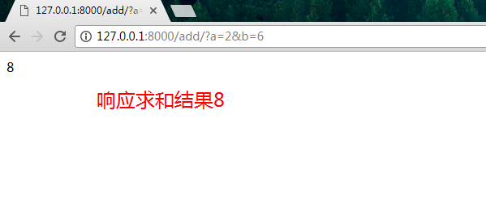
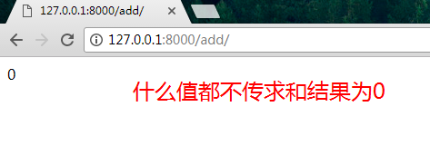
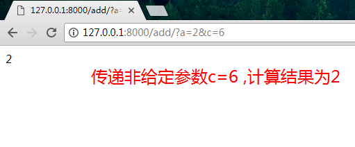
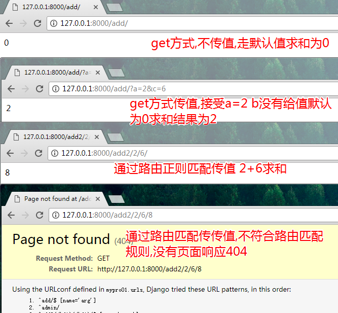
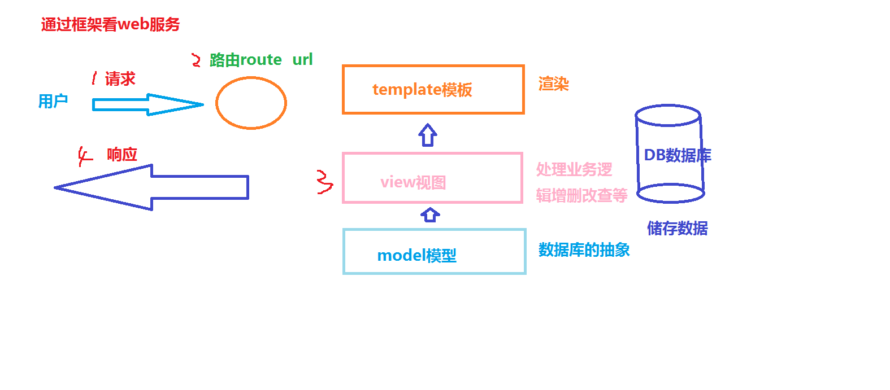

# 路由传递参数传递

## get传递参数实现求和
1 `mypro1`项目中,增加一个 app，命名为 calc(计算)
```
python manage.py startapp calc
```
2 修改一下 `calc/views.py `文件：
```python
from django.shortcuts import render
from django.http import HttpResponse
# 新建一个add方法
def add(request):
    # a 和 b 两个变量通过 get 方法获取参数。如果没有获取到，就默认赋值为 0。
    # url传递的参数必须以?a=数值1&b数值2的形式传递进来
    a = request.GET.get('a', 0)
    b = request.GET.get('b', 0)
    c = int(a) + int(b)
    # 求和的结果转化成字符串响应输出
    return HttpResponse(str(c))
```

3 修改` urls.py` 文件，来设置路由：
```python
from django.conf.urls import url
from django.contrib import admin
from learn import views as learn_views
# 添加计算视图文件到路由中
from calc import views as calc_views


urlpatterns = [
    # add是传递的参数 这些参数 以 name = `arg` 键值对的形式传递进来,这里的参数 name必须为name名 此处的关键字参数函数 
    url(r'^add/$', calc_views.add, name='arg'),  # 注意修改了这一行
    # url(r'$', learn_views.index), # 这一行先注释，因为 $ 会造成匹配混乱
    url(r'^admin/', admin.site.urls),
]
```

4 运行
```
python manage.py runserver 0.0.0.0:8000
```
5 显示结果





 

6 小结
加法操作在 Django 服务端中实现流程：当键入指定的网址时，我们通过 get 的写法在 URL 上进行明文数据传输。当 Django 通过 `urls.py` 匹配到指定的 URL 时，会调用 calc app 中 `views.py` 中的 `add` 方法。`add` 使用 get 获取参数的写法获取到 a 和 b 两个参数，并在反馈给用户渲染页面之前完成计算一起返回到客户端，并以文本的方式加以渲染浏览器显示的页面。

* 浏览器输入url地址,通过路由`url.py`路由匹配,?后面代表传递的参数
* 触发 对应app中的视图文件 `views.py`对应的方法 `add`
* `add`方法通过get获取参数a、b的值,计算返回到客户端

## 路由正则匹配实现加法
6 路由使用的是正则匹配原理，可以通过`/add/2/6/ `这种格式，将数据匹配出来并随着 `request`参数一起传到 `views.py`，完成 `2 + 6 `的运算.重新编辑一下 `views.py`，增加一个新方法 `add2`：
```python
from django.shortcuts import render
from django.http import HttpResponse

def add(request):
    a = request.GET.get('a', 0)
    b = request.GET.get('b', 0)
    c = int(a) + int(b)
    return HttpResponse(str(c))
# 添加新方法 
# 注意参数获取的方式是通过路由直接获取值
def add2(request, a, b):
    c = int(a) + int(b)
    return HttpResponse(str(c))
```
7 `urls.py`中为新方法传递 a 和 b 两个变量，编辑 `urls.py `文件：
```python
from django.conf.urls import include, url
from django.contrib import admin
from learn import views as learn_views
from calc import views as calc_views

urlpatterns = [
     url(r'^admin/', include(admin.site.urls)),
     # url(r'$', learn_views.index),
     url(r'^add/$', calc_views.add, name = 'add'), 
     url(r'^add2/(\d+)/(\d+)/$', calc_views.add2, name = 'argg'),
]
```
8 测试,查看结果


9 小结 
掌握Django 中的视图 `views.py` 和路由`urls.py`的用法，简单上手 Web 服务端开发。实现在线加法功能。

## 看图

* 1 请求 get方式传递参数
* 2 __路由检查请求指向__ 检查请求是否合法 | 通过路由传递参数
* 3 __视图处理__ 接受请求的值处理求和响应结果
* 4 响应 

## 作业练习,就是想方法让自己独立写出以上代码
* 新建一个app `calc`
* 访问add/?a=6&b=9实现求和
* 访问add/2/6/ 实现求和