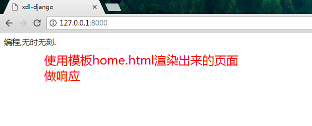
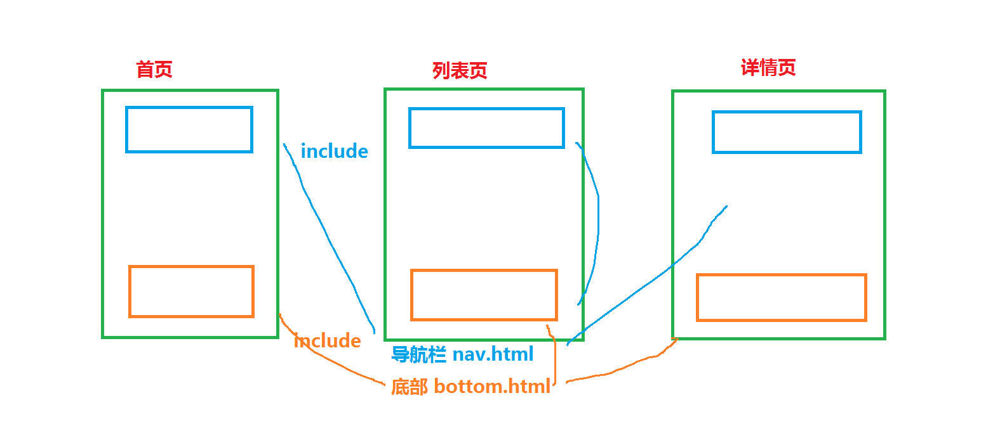
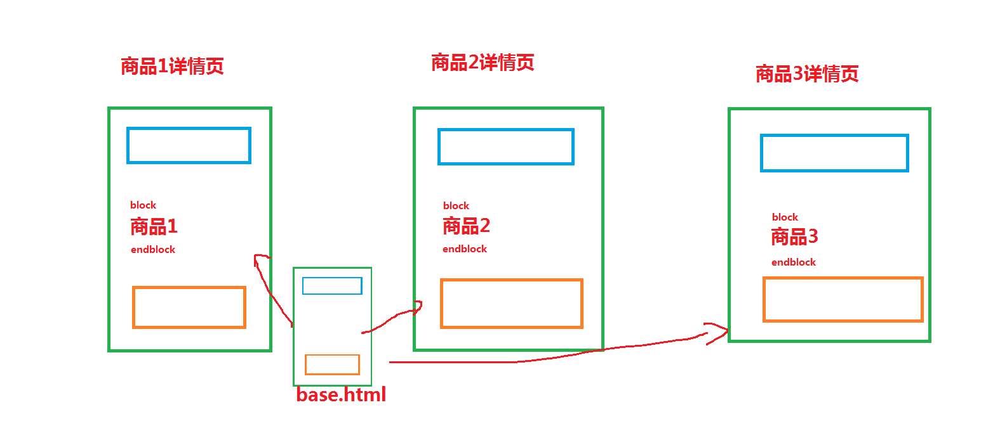
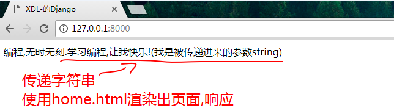
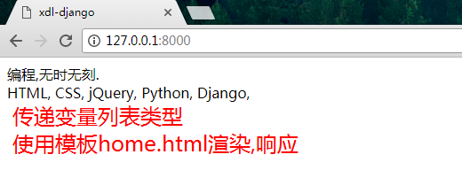
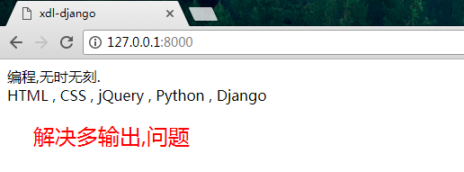
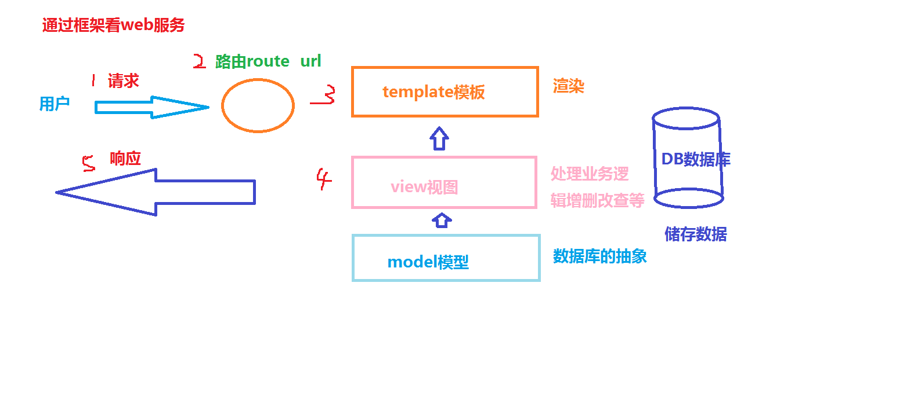

# 模板 template

## 视图响应返回模板
1 继续使用`mypro1`项目，在 `learn` 这个 app 中添加功能。开始编辑其 `views.py` 文件，增加一个 home 方法：
```python
from django.shortcuts import render
from django.http import HttpResponse

def index(request):
    # index方法响应字符串
    return HttpResponse(u'你好,世界!')

def home(request):
    # home方法响应home.html页面
    return render(request, 'home.html')
```
在 learn 目录下增加一个 `templates` 目录，用来放置模板文件。__在 Django 的默认配置中，模板文件放在对应 app 的 templates 的目录中。__所以我们新建的这个目录中存放的模板文件，Django 会自动在此查询文件。

2 新建 templates 目录，创建 `home.html `文件：
```html
<!DOCTYPE html>
<html>
<head>
    <meta charset="utf-8">
    <title>xdl-django</title>
</head>
<body>
      编程,无时无刻.
</body>
</html>
```
3 在修改完 `views.py `之后，来配置一下链接路由：
```python
from django.conf.urls import include, url
from django.contrib import admin
from learn import views as learn_views
from calc import views as calc_views

urlpatterns = [
    url(r'^admin/', include(admin.site.urls)),
    # learn_views.home这个home为方法名 name="home"这个home为参数名,这个home可以是任意值
    url(r'^$', learn_views.home, name = 'home'),
]
```
4 程序运行,测试查看效果


## 模板继承
5 网站有很多通用的部分。例如导航条、页底、访问统计等等。我们可以使用 include 关键字，来通过引入通用文件来插入 html 标记中：
有一个 `base.html` 模板文件
```html
<!DOCTYPE html>
<html>
<head>
    <meta charset="utf-8">
    <title>xdl-django</title>
</head>
<body>




<div>这里是默认内容，所有继承自这个模板的，如果不覆盖就显示这里的默认内容。</div>




</body>
</html>

```
这就好比每一个页面的基础模板，根据每个网页的不同，再进行定制的修改此文件即可。而定制部分即上例中的__block__关键字部分。


6 首页`index.html`通过模板继承实现对base.html模板的继承使用
```html

欢迎光临首页


  <h1>这里是首页，欢迎光临</h1>

```


7 看一下图例



8 __Django 模板查找机制：__
> 查找模板的过程是在每个 app 的 templates 目录中找，每个 app 的 template 形成一个目录列表，Django 遍历这个列表，一个个目录进行查询，当在某一个目录中找到时就停止，所有的都遍历之后，仍旧找不到指定的模板，则进入 Template Not Found 状态。这一点与 Python 对包的查询过程十分类似。这样的设计当然也有利弊，好处是一个 app 可以用另一个 app 的模板文件，而弊端就是可能会发现查询错误的情况，所以我们在 templates 中再以 app 名对其进行细分，则会更加清晰。例如下面这个项目的目录结构，就是我比较推荐的：


***

```
mypro
├── goods
│   ├── __init__.py
│   ├── admin.py
│   ├── models.py
│   ├── templates
│   │   └── goods
│   │       ├── index.html
│   │       └── search.html
│   ├── tests.py
│   └── views.py
├── users
│   ├── __init__.py
│   ├── admin.py
│   ├── models.py
│   ├── templates
│   │   └── users
│   │       ├── index.html
│   │       └── poll.html
│   ├── tests.py
│   └── views.py
├── manage.py
└── mypro
    ├── __init__.py
    ├── settings.py
    ├── urls.py
    └── wsgi.pyk
```
这样，使用的时候，模板就是 `goods/index.html` 和 `users/index.html` 这样有app作为名称的一部分，就不会混淆


## 视图响应渲染模板
### 条件判断与循环
9  修改 learn 的 `views.py` 文件的 `home` 方法：
```python
from django.shortcuts import render
from django.http import HttpResponse

def index(request):
    # index方法响应字符串
    return HttpResponse(u'你好,世界!')

def home(request):
    string = u"学习编程,让我快乐!(我是被传递进来的参数string)"
    # 通过render渲染模板,将string变量值传递到模板(就是html文件)中
    return render(request, 'home.html', {'string': string})
```
10 在 home.html 中，使用 {{ string }} 标记就可以把改字符串传递进来：
```html
<!DOCTYPE html>
<html>
<head>
    <meta charset="utf-8">
    <title>xdl-django</title>
</head>
<body>
      编程,无时无刻.{{ string }}
</body>
</html>
```

11 测试查看结果 




12 不仅可以传递字符串，还可以将 List 内容传递至模板中。
操作视图 `view.py`
```python
from django.shortcuts import render
from django.http import HttpResponse

def index(request):
    # index方法响应字符串
    return HttpResponse(u'你好,世界!')

def home(request):
    TutorialList = ["HTML", "CSS", "jQuery", "Python", "Django"]
    return render(request, 'home.html', {'TutorialList': TutorialList})

```

13 有 List 的地方只有遍历才能将其数据全部取出。所以模板文件可以使用 for 循环对传入的 List 变量进行遍历操作：
操作模板文件 `home.html`
```html
<!DOCTYPE html>
<html>
<head>
    <meta charset="utf-8">
    <title>xdl-django</title>
</head>
<body>
        编程,无时无刻.{{ string }} <br />
        
            {{ i }},
        
</body>
</html>
```
14 测试结果为: 



15 还有一些小的瑕疵，在字符串 Django 后面仍旧有一个逗号。这里继续使用模板中的条件语句标记来修改这个瑕疵。
```html
<!DOCTYPE html>
<html>
<head>
    <meta charset="utf-8">
    <title>xdl-django</title>
</head>
<body>
        编程,无时无刻.{{ string }} <br />
        
            {{ i }}
            
                ,
            
        
</body>
</html>
```
只需要判断是否为 List 中的最后一个元素即可。解决了这个 bug。

16 运行查看结果



17 小结
> 主要介绍了在 `views.py`与模板之间的数据传递与获取
> Django 模板的基本使用。了解后端数据传至前端的过程。
> [官方文档](https://docs.djangoproject.com/en/1.11/ref/templates/builtins/)

## 看图

* 1 请求 
* 2 __路由检查请求指向__ 检查请求是否合法 
* 3 __模板__  响应的一个页面 需要视图去渲染(往里面添加数据等等)
* 4 __视图处理__ 接受请求的值处理求和响应结果
* 5 响应

## 作业练习,就是想方法让自己独立写出以上代码
* app `learn`中 
* 视图使用模板`home.html` 编程,无时无刻的页面
* 视图渲染模板添加字符串`学习编程,让我快乐!(我是被传递进来的参数string)`然后响应
* 视图渲染模板添加列表 `["HTML", "CSS", "jQuery", "Python", "Django"]`然后一个一个响应出来