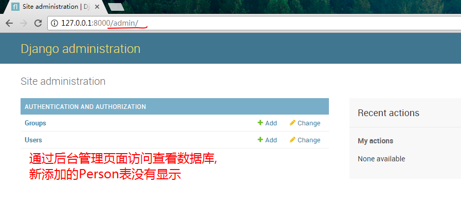

# 模型Model和数据库DB
## 使用模型
1 Django 模型是与数据库相关的

* 与数据库相关的代码一般写在 models.py 中
* Django 支持 Sqlite3、MySQL、PostgreSQL 等数据库
* 只需要在 `settings.py `中配置即可，不用更改 `models.py` 中的代码，丰富的 API 极大的方便了使用。

2  查看'setting.py'中数据库设置
```python
# Database
# https://docs.djangoproject.com/en/1.11/ref/settings/#databases

DATABASES = {
    'default': {
        # 默认选择的数据库为sqlite3,可以根据项目情况调整
        'ENGINE': 'django.db.backends.sqlite3',
        'NAME': os.path.join(BASE_DIR, 'db.sqlite3'),
    }
}

```

3 继续使用 learn 这个 app 。修改 learn 中的 `models.py` 如下所示：
```python
from django.db import models

# Create your models here.
class Person(models.Model):
    # 创建Person表里面有两个字段,name char类型 age int类型
    name = models.CharField(max_length=30)
    age = models.IntegerField()
```
新建了一个 Person 类，继承自 `models.Model`，一个人有年龄和姓名。这里用到了两种 __Field(字段)__。

4 来执行__同步数据库__操作（我们使用默认的__sqlite3__数据库，无需任何其他配置）：
```
python manage.py makemigrations
python manage.py migrate
```
不做迁移创建超级管理员(createsuperuser)账号时可能会报错

5 查看结果: 
***

***
Django 生成了新建的 Person 表。

6 Django 提供了丰富的 API，下面演示使用：
```
C:\Users\Administrator\Desktop\demo\mypro01>python manage.py shell
Python 3.6.2 (v3.6.2:5fd33b5, Jul  8 2017, 04:57:36) [MSC v.1900 64 bit (AMD64)]
 on win32
Type "help", "copyright", "credits" or "license" for more information.
(InteractiveConsole)
>>> from learn.models import Person
>>> Person.objects.create(name="Zhang", age=28)
<Person: Person object>
>>>
```
7 新建了一个用户 Zhang，从数据库中查询它:
```
>>> Person.objects.get(name="Zhang")
<Person: Person object>
```
* 使用`.objects.get()` 方法查询出来符合条件的对象
* 但是查询结果中只显示 `<Person: Person object>`
* 并没有显示出与 Zhang相关的信息
* 如果用户多了就无法知道查询出来是哪一条数据。查询结果是否正确

8 重新修改一下 `learn/models.py`
> 备注：name 和 age 等字段中不能有 __（双下划线，因为在Django QuerySet API中有特殊含义（用于关系，包含，不区分大小写，以什么开头或结尾，日期的大于小于，正则等）。也不能有Python中的关键字try, class, continue 不合法，因为它是Python的关键字( import keyword; print(keyword.kwlist) 可以打出所有的关键字)。

```python
from django.db import models

# Create your models here.
class Person(models.Model):
    name = models.CharField(max_length=30)
    age = models.IntegerField()

    # Person类中添加模式方法 返回对象的name属性
    def __str__(self):
        return self.name
```
 
9 再次查看数据库
```
>>> Person.objects.get(name="Zhang")
<Person: Zhang>
```

## 通过超级管理员进入django管理后台
10 创建管理员账号
```
# 按照提示输入用户名和对应的密码可以，邮箱可以留空，用户名和密码必填
python manage.py createsuperuser
```

11 查看结果

并没有迁移数据库信息 

12 找到`learn/admin.py`
```python
from django.contrib import admin

# Register your models here.
# 注册person模块到admin 后台管理界面中
from .models import Person

admin.site.register(Person)
```

13 再次查看结果


14 参考文档
> [模型models官方教程](https://docs.djangoproject.com/en/1.11/topics/db/models/)

> [字段Fields官方文档](https://docs.djangoproject.com/en/1.11/ref/models/fields/)

15 小结
* 模型与数据库之间的交互

## 看图

* 1 创建__模型__  模型是对现实生活中对象类型的抽象  
* 2 迁移到__数据库__中  数据库中纯的是对象的属性和数据
* 想想之前学的__对象__都是有属性和方法 

## 作业练习,就是想方法让自己独立写出以上代码
* 查看数据库的相关配置文件 可以选择数据库mysql oracle等
* 在`model`中新建一个`Person`对象 name和age两个属性 
* 迁移到数据库中
* 在shell窗口中实现对Person窗口 添加用户 查看用户
* 创建超级用户登录admin后台,查看数据库中person表