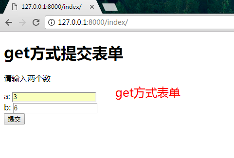
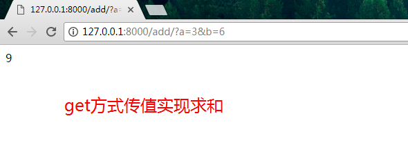

# Django 处理表单提交数据-Django-forms

## get方式提交表单

1 前端通过表单提交数据a和b,后端求a和b的和并且显示出来

* 在前端用 get 或 post 方法提交一些表单数据
* 在后端需要接受和处理这些数据

在`learn/templates`里面先写一个表单页面`index.html`
```html
<!DOCTYPE html>
<html>
	<meta charset="UTF-8">
<body>
<h1>get方式提交表单</h1>
<p>请输入两个数</p>
<!--form表单以get方式提交到地址/add/ -->
<form action="/add/" method="get">
    a: <input type="text" name="a"> <br>
    b: <input type="text" name="b"> <br>
    <input type="submit" value="提交">
</form>
</body>
</html>
```
前端传递的参数 为a=值1和b=值2

2 后端 `learn/view.py`接受并且处理
```python
from django.http import HttpResponse
from django.shortcuts import render
# index方法 处理get请求返回index.html的表单页面
def index(request):
    #render渲染,响应
    return render(request, 'index.html')
# add方法负责接受前端get方式提交的数据 并且进行求和操作
def add(request):
    a = request.GET.get('a', None)
    b = request.GET.get('b', None)
    a = int(a)
    b = int(b)
    return HttpResponse(str(a+b))
```
3 修改路由 `mypro01/urls.py`
```python
from django.conf.urls import include, url
from django.contrib import admin
from learn import views as learn_views
from calc import views as calc_views

urlpatterns = [
    url(r'^admin/', include(admin.site.urls)),
    # 通过路由解析index 触发view中的index方法
    url(r'^index/', learn_views.index),
    # 通过路由解析add 触发view中的add方法 add方法接受参数
    url(r'^add/$', learn_views.add, name='add'),
]
```

4 访问地址`127.0.0.1:8000/index`
请求地址响应表单

处理返回结果


* `/index/`,触发view中的index方法,响应表单,`/add/`触发view中add方法,处理数据求和
* 使用__get__方法进行表单提交，相当于通过表单进行__get__传递参数的一种变化形式
* 其原理与之前的参数传递没有区别。
* 但是通过此方法，可以__以界面的方式对参数进行传递，增强了用户体验__。

## post方式提交表单
5 创建一个文件`learn/forms.py`
```python
# 导入django的forms
from django import forms
# 创建一个类Addform添加表单
class AddForm(forms.Form):
    a = forms.IntegerField()
    b = forms.IntegerField()
```
6 修改视图`learn/view.py`
```python
from django.shortcuts import render
from django.http import HttpResponse
#导入forms
from .forms import AddForm

# index方法 处理get请求返回index.html的表单页面
def index(request):
    return render(request, 'index.html')
    
def index2(request):
	# 当表单提交方式为POST时候
    if request.method == 'POST':
      	# 接受表单POST数据
        form = AddForm(request.POST)
        # 如果提交的表单有效
        if form.is_valid():
            a = form.cleaned_data['a']
            b = form.cleaned_data['b']
            return HttpResponse(str(int(a) + int(b)))
    else:
        # 正常方位时
        form = AddForm()

    return render(request, 'index2.html', {'form': form})
    
# add方法负责接受前端get方式提交的数据 并且进行求和操作
def add(request):
    a = request.GET.get('a', None)
    b = request.GET.get('b', None)
    a = int(a)
    b = int(b)
    return HttpResponse(str(a + b))
```
7 创建前端post表单页面 `learn/templates/index2.html`
```
<!DOCTYPE html>
<html>
    <meta charset="UTF-8">
<body>
<h1>post方式提交表单</h1>
<p>请输入两个数</p>
<!--form表单以post方式提交到当前地址 -->
<form  method="post">
    
    {{ form }}
    <input type="submit" value="提交">
</form>
</body>
</html>
```
8 修改路由 `learn/urls.py`
```
ffrom django.conf.urls import include, url
from django.contrib import admin
from learn import views as learn_views
from calc import views as calc_views

urlpatterns = [
    url(r'^admin/', include(admin.site.urls)),
    # 通过路由解析index 触发view中的index方法
    url(r'^index/', learn_views.index),
    # 通过路由解析add 触发view中的add方法 add方法接受参数
    url(r'^add/$', learn_views.add, name='add'),
    # 通过路由解析 默认显示post表单页面
    url(r'^$', learn_views.index2, name='home'),
]
```

9 测试结果
get和post表单

get和post计算结果

Django 的 forms 提供了好用的几个功能:

* 模板中表单的渲染；
* 数据验证工作，即使输入数据不合法,也不会丢失已经输入的数据；
* 定制更复杂的验证工作，如提供了 10 个输入框，其中两个以上为必填项，在 forms.py 中实现都是很容易。
* 也有一些将 Django forms 渲染成 Bootstrap 的插件，使用起来十分方便

10 参考文档
```
[forms相关文档](https://docs.djangoproject.com/en/1.11/search/?q=forms)
[使用forms](https://docs.djangoproject.com/en/1.11/topics/forms/)
```
11 小结

使用 Django 对前端表单提交的数据做出合理处理，并向前端页面进行渲染反馈。表单提交有 __get__ 和 __post__两种常用方法。

## 看图

* 1 `请求` `响应`get方式请求响应get表单页面 |post方式请求,通过forms.py 创建表单`响应` `请求` get|post方式提交数据
* 2 __路由检查请求指向__ 检查请求是否合法 
* 3 __模板__  响应的一个页面 需要视图去渲染(往里面添加数据等等)
* 4 __视图处理__ 接受get|post请求的数据,处理求和响应结果
* 5 响应

## 作业练习,就是想方法让自己独立写出以上代码
* get和post方式请求分别实现求和