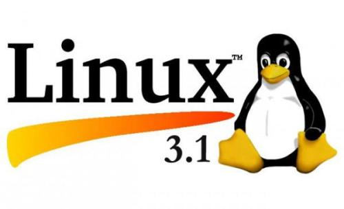
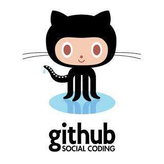
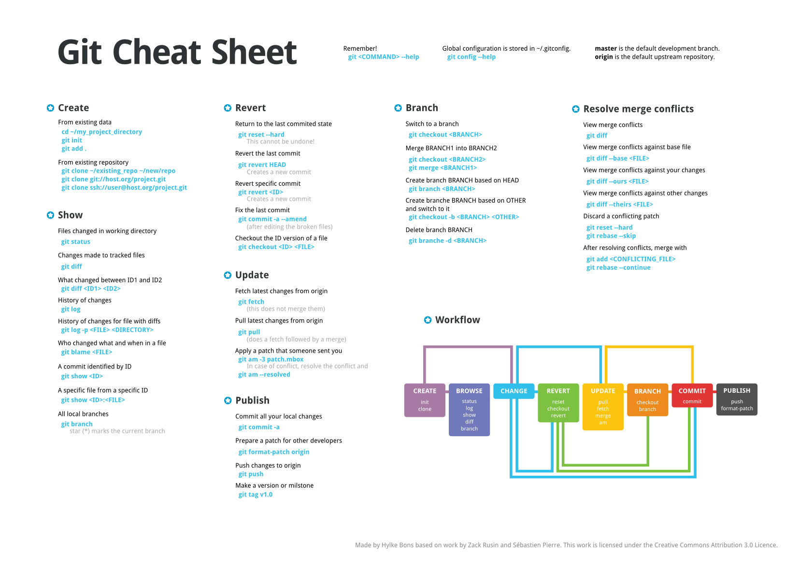

# Git介绍
* `Git`傻子的意思 

* `Git` 和`Linux`之父是 __Linus__ 

> 我是一个自负的混蛋,所有我的项目都以我自己的名字命名,先有Linux,现在是Git --Linus

## Git和GitHub
* GIt global information tracker 全局信息跟踪器 
* `Git` __版本控制工具__ 
* 2008年出现了`GitHub`,`GitHub`是全球最大的__项目托管平台__
* `GitHub`改变了软件开发的流程,不管开发什么项目都可以在github上找到别人开发的现成代码进行参考,重造轮子的时代一去不复返了
* `GitHub`让`Git`的使用变得更简单,`Git`是一个命令行工具; 

## github的使用方式
> 1 可以通过网站

> 2 客户端 

> 3 git commands命令  

*** 

