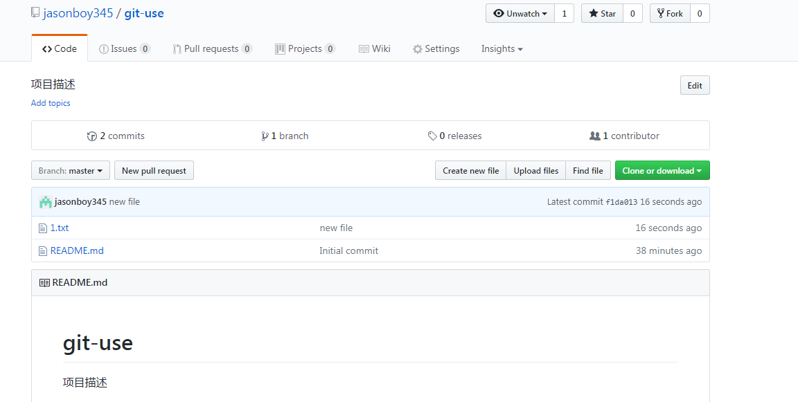

# 通过Git拉去远端仓库并且提交
> 拉取github中项目仓库,
本地修改项目文件,
提交到远端仓库


## 创建新项目
1 创建项目仓库


2 查看创建的项目


## 拉取github中的仓库到本地
3 进到任意文件目录 


4 复制仓库ssh地址 
> SSH非对称加密方式建立信任


5 克隆github中的远端项目到本地
```
git clone "仓库ssh地址"
```


> 这样复制下来的项目可以本地修改,做版本,如果要做远端提交我们设置一些全局信息生成项目秘钥


## 初始化设置全局信息 

6 添加github用户名
```
git config --global user.name "Your Name"
```


7 添加github邮箱
```
git config --global user.email "email@example.com"
```


> 无论Linux还是Windows，安装完后都要初始化配置。
```	
	git config --global user.name "Your Name"
	git config --global user.email "email@example.com"
```
目的：git操作身份记录，--global全局配置，也可不加。


## 生成秘钥具备项目发布权限

8 生成rsa密钥对


```
ssh-keygen -t rsa
```


9 复制秘钥


10 项目秘钥添加页面


11 添加秘钥


## 本地项目添加新文件做版本发布到远端仓库

12 添加 做版本 发布

__以下命令为高频命令__

```
git add -A 添加所有文件及目录
git commit -m "message" 做一个版本,版本留言
git push 项目发布到远端仓库
```


13 以上添加的具体流程图

`git add` 将本地项目提交到stage中 


`git commit`  将stage中的项目做成版本到master分支中


* git工作流


## 查看远端仓库和版本信息

14 查看远端github仓库


15 查看仓库中项目的版本信息


