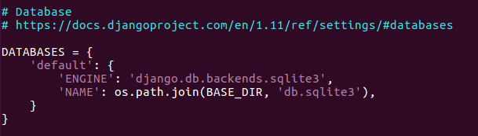
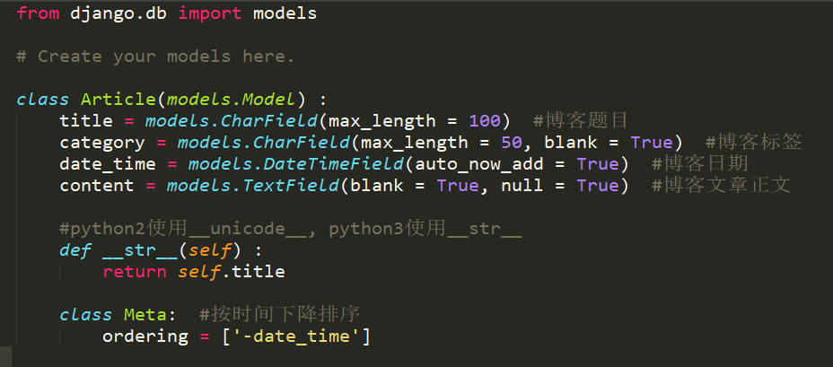
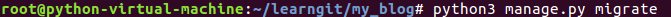
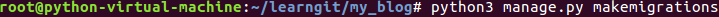
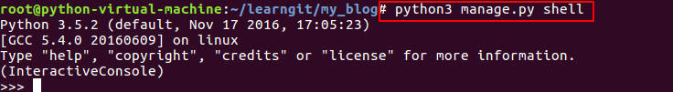

# Models

## Django Model

* 每一个`Django Model`都继承自`django.db.models.Model`
* 在`Model`当中每一个属性`attribute`都代表一个database field
* 通过`Django Model API`可以执行数据库的增删改查, 而不需要写一些数据库的查询语句

## 设置数据库
Django项目建成后, 默认设置了使用SQLite数据库, 在my_blog/my_blog/setting.py中可以查看和修改数据库设置:




还可以设置其他数据库, 如MySQL, PostgreSQL, 现在为了简单, 使用默认数据库设置

## 创建models
在my_blog/article/models.py下编写如下程序:



其中`__str__(self)`函数Article对象要怎么表示自己, 一般系统默认使用`` 来表示对象, 通过这个函数可以告诉系统使用title字段来表示这个对象

* `CharField` 用于存储字符串, max_length设置最大长度
* `TextField` 用于存储大量文本
* `DateTimeField` 用于存储时间, auto_now_add设置True表示自动设置对象增加时间

## 同步数据



因为我们已经执行过该命令会出现如下提示

```
Operations to perform:
      Apply all migrations: admin, contenttypes, sessions, auth
    Running migrations:
      No migrations to apply.
      Your models have changes that are not yet reflected in a migration, and so won't be applied.
      Run 'manage.py makemigrations' to make new migrations, and then re-run 'manage.py migrate' to apply them.
```

那么现在需要执行下面的命令


```
    #得到如下提示
    Migrations for 'article':
      0001_initial.py:
        - Create model Article
```
> migrate命令按照app顺序建立或者更新数据库, 将`models.py`与数据库同步

现在重新运行以下命令


```
    #出现如下提示表示操作成功
    Operations to perform:
      Apply all migrations: auth, sessions, admin, article, contenttypes
    Running migrations:
      Applying article.0001_initial... OK
```

现在我们进入Django中的交互式shell来进行数据库的增删改查等操作



> 这里进入Django的shell和python内置的shell是非常类似的

```
    >>> from article.models import Article
    >>> #create数据库增加操作
    >>> Article.objects.create(title = 'Hello World', category = 'Python', content = '我们来做一个简单的数据库增加操作')

    >>> Article.objects.create(title = 'Django Blog学习', category = 'Python', content = 'Django简单博客教程')

    >>> #all和get的数据库查看操作
    >>> Article.objects.all()  #查看全部对象, 返回一个列表, 无对象返回空list
    [, ]
    >>> Article.objects.get(id = 1)  #返回符合条件的对象

    >>> #update数据库修改操作
    >>> first = Article.objects.get(id = 1)  #获取id = 1的对象
    >>> first.title
    'Hello World'
    >>> first.date_time
    datetime.datetime(2014, 12, 26, 13, 56, 48, 727425, tzinfo=)
    >>> first.content
    '我们来做一个简单的数据库增加操作'
    >>> first.category
    'Python'
    >>> first.content = 'Hello World, How are you'
    >>> first.content  #再次查看是否修改成功, 修改操作就是点语法
    'Hello World, How are you'

    >>> #delete数据库删除操作
    >>> first.delete()
    >>> Article.objects.all()  #此时可以看到只有一个对象了, 另一个对象已经被成功删除
    []

```

