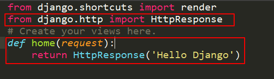
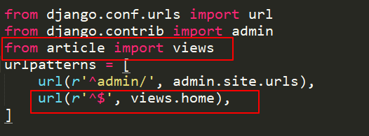
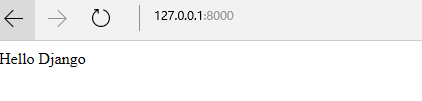
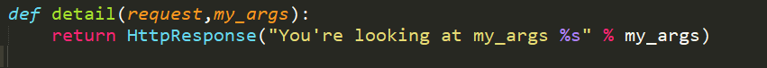
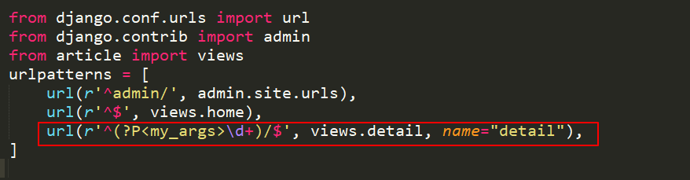
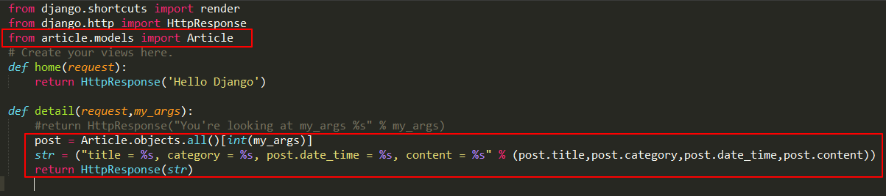
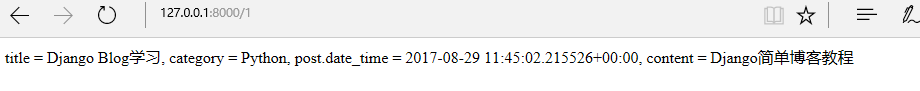

# Views和URL

**网页程序的逻辑**

> request进来->从服务器获取数据->处理数据->把网页呈现出来

* `url`设置相当于客户端向服务器发出request请求的入口, 并用来指明要调用的程序逻辑
* `views`用来处理程序逻辑, 然后呈现到template(一般为`GET`方法, `POST`方法略有不同)
* `template`一般为html+CSS的形式, 主要是呈现给用户的表现形式

**简单Django Views和URL**

Django中views里面的代码就是一个一个函数逻辑, 处理客户端(浏览器)发送的HTTPRequest, 然后返回HTTPResponse,
那么那么开始在my_blog/article/views.py中编写简单的逻辑

那么如何使这个逻辑在http请求进入时, 被调用呢, 这里需要在`my_blog/my_blog/urls.py`中进行url设置

`url()`函数有四个参数, 两个是必须的:regex和view, 两个可选的:kwargs和name

* `regex`是regular expression的简写,这是字符串中的模式匹配的一种语法, Django 将请求的URL`从上至下`依次匹配列表中的正则表达式，直到匹配到一个为止。
* `view`当 Django匹配了一个正则表达式就会调用指定的view逻辑, 上面代码中会调用article/views.py中的home函数
* `kwargs`任意关键字参数可传一个字典至目标view
* `name`命名你的 URL, 使url在 Django 的其他地方使用, 特别是在模板中

现在在浏览器中输入127.0.0.1:8000应该可以看到下面的界面

**Django Views和URL更近一步**

很多时候我们希望给view中的函数逻辑传入参数, 从而呈现我们想要的结果

现在我们这样做, 在my_blog/article/views.py加入如下代码:

在my_blog/my_blog/urls.py中设置对应的url,

`^(?P<my_args>\d+)/$`这个正则表达式的意思是将传入的一位或者多位数字作为参数传递到views中的detail作为参数, 其中?P定义名称用于标识匹配的内容

一下url都能成功匹配这个正则表达数

* `http://127.0.0.1:8000/1000/`
* `http://127.0.0.1:8000/9/`

**尝试传参访问数据库**

修改在my_blog/article/views.py代码:

> 这里最好在admin后台管理界面增加几个Article对象, 防止查询对象为空, 出现异常

现在可以访问http://127.0.0.1:8000/1/

显示如下数据表示数据库访问正确(这些数据都是自己添加的), 并且注意Article.objects.all()返回的是一个列表

小结:
* 如何编写views和设置url
* 如何通过url向views传参
* 如何通过参数来访问数据库资源

