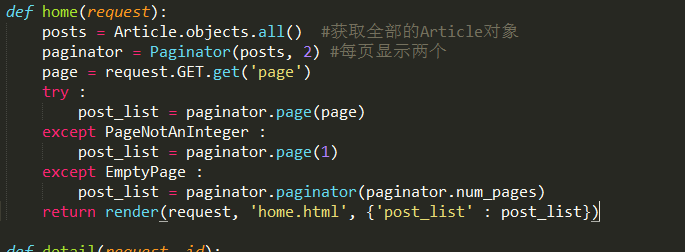

# 分页
> 现在这一章节来看看怎么实现分页功能

* 首先添加包
* 重写home方法
* 修改模板

在my_blog/my_blog/views.py中引入包


修改my_blog/my_blog/views.py中的home函数




修改my_blog/templates下的home.html

```




<div class="posts">
    
        <section class="post">
            <header class="post-header">
                <h2 class="post-title"><a href="">{{ post.title }}</a></h2>

                    <p class="post-meta">
                        Time:  <a class="post-author" href="#">{{ post.date_time |date:'Y M d'}}</a> <a class="post-category post-category-js" href="">{{ post.category|title }}</a>
                    </p>
            </header>

                <div class="post-description">
                    <p>
                        {{ post.content|custom_markdown|truncatewords:10 }}
                    </p>
                </div>
                <a class="pure-button" href="">Read More >>> </a>
        </section>
    

    
      <div>
      <ul class="pager">
      
        <li><a href="?page={{ post_list.previous_page_number }}">上一页</a></li>
      

      
        <li><a href="?page={{ post_list.next_page_number }}">下一页</a></li>
      
      </ul>
      </div>
    
</div><!-- /.blog-post -->

```


