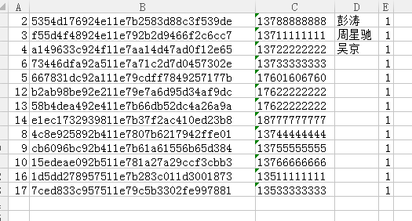

# 第七天

## 知识点

## 任务

#### 爬虫+大数据


#### linux网络和安全


#### web


### other-爬取api

> API接口文档


```
爬去的帐号：
{"token":"85ffdd30978711e796229c8782876907", "guid":"88e85d36924d11e7ae8d209c95fd15c6", "create_time":1505199398000}

登录演示的帐号：13722222222 密码 123456

请求地址：https://tina.henanmeijie.cn

团队api接口:
    请求方式：get
    地址：team/allmember    //完整的地址就是https://tina.henanmeijie.cn/team/allmember
参数:{'guid':'88e85d36924d11e7ae8d209c95fd15c6',
      'timestamp':1505199880000,
      'rand':610422,
      'signature':'3ccf09d492794b399182cba22f398c84'
      }
    //guid固定的要爬区的用户信息的guid   固定的用户的guid 为85ffdd30978711e796229c8782876907
    //timestamp时间戳（毫秒）自己获取  后台验证了时效性 3秒
    //rand 6位随机数          自己生成
    //signature： md5 hash后的字符串
    //即 signature = md5(guid+token+timestamp+rand);

返回：{'res':1, 'info':'数据'} 或 '请求失败' 或 {'res':0, 'info':'失败的提示相关信息如前面失败等'}
    //提示：数据为数组，数组的每个元素对应一个对象，是一个用户的信息

```


> 脚本

```python
import requests
from openpyxl import Workbook
# from hashlib import md5


"""
get_json()函数 获取json数据

url         请求地址
guid        用户的guid
timestamp   时间戳
rand        随机数
signature   md5加密后的签名 签名规则 api提供 signature = md5(guid+token+timestamp+rand)

info_list   返回爬取到的json数据
"""

def get_json(url, guid, timestamp, rand, signature):
    # 所有参数封装到data中
    data = {'guid': guid, 'timestamp': timestamp, 'rand': rand, 'signature': signature}
    # get方式请求url并且传递参数,返回数据通过json方法解析
    json = requests.get(url,data).json()

    info_list = []
    # print(json['res'])
    # 判断是否获得返回数据
    if json['res'] == 1:

        # 获取json[info] 下标的数据
        list_con = json['info']
        # print(type(json))
        
        # 遍历json数据
        for i in list_con:
            info = []
            info.append(i['id'])
            info.append(i['guid'])
            info.append(i['nickname'])
            info.append(i['realname'])
            info.append(i['sex'])
            info_list.append(info)

    return info_list

"""
main()函数  爬取api,并且导出到xls中


"""

def main():
    # get_json参数
    guid = '88e85d36924d11e7ae8d209c95fd15c6'
    token = '85ffdd30978711e796229c8782876907'
    timestamp = 1505199880000
    rand = 610422
    timestamp = 1505199880000
    # signature = md5(guid+token+timestamp+rand)
    signature = '3ccf09d492794b399182cba22f398c84'
    url = 'https://tina.henanmeijie.cn/team/allmember'
    
    info_result = []

    # 执行get_json()函数 实现api爬取
    info = get_json(url, guid, timestamp, rand, signature)
    
    # 爬取到的数据进行
    info_result = info_result + info
    # print(info)

    # 创建excel工作簿
    wb = Workbook()
    # 激活工作簿 
    ws1 = wb.active
    # sheet设置为
    ws1.title = 'API爬取'
    # 遍历往工作簿中写入数据 
    for row in info_result:
        ws1.append(row)
    wb.save('json数据.xlsx')

if __name__ == '__main__':
    main()


```

> 爬取结果

