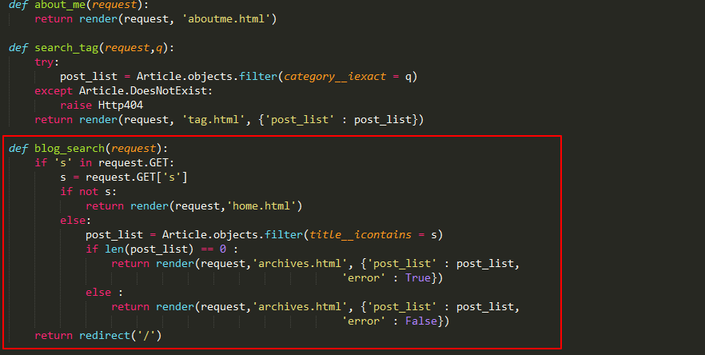
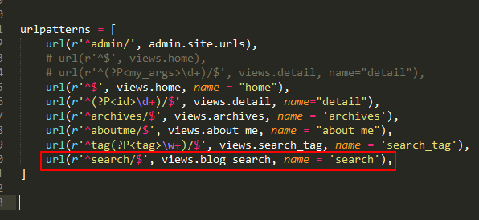

# 搜索

**搜索功能**

搜索功能的实现设计

* 前段界面输入搜索关键字, 传送到对应view中
* 在对应的view中进行数据库关键字搜索
* 这里搜索可以只对文章名搜索或者全文搜索

首先在my_blog/templates下添加所有输入框

```
<div class="sidebar pure-u-1 pure-u-md-1-4">
        <div class="header">
            <h1 class="brand-title"><a href="">Andrew Liu Blog</a></h1>
            <h2 class="brand-tagline"> - Snow Memory</h2>
            <nav class="nav">
                <ul class="nav-list">
                    <li class="nav-item">
                        <a class="button-success pure-button" href="/">主页</a>
                    </li>
                    <li class="nav-item">
                        <a class="button-success pure-button" href="">归档</a>
                    </li>
                    <li class="nav-item">
                        <a class="pure-button" href="https://github.com/Andrew-liu/my_blog_tutorial">Github</a>
                    </li>
                    <li class="nav-item">
                        <a class="button-error pure-button" href="#">Weibo</a>
                    </li>
                    <li class="nav-item">
                        <a class="button-success pure-button" href="/">专题</a>
                    </li>
                    <li>
                    <form class="pure-form" action="/search/" method="get">
                    <input class="pure-input-3-3" type="text" name="s" placeholder="search">
                    </form>
                    </li>
                    <li class="nav-item">
                        <a class="button-success pure-button" href="">About Me</a>
                    </li>
                </ul>
            </nav>
        </div>
    </div>
```

在my_blog/article/views.py中添加查询逻辑




这里为了简单起见, 直接对archives.html进行修改, 使其符合查询逻辑

```



<div class="posts">
    
        <h2 class="post-title">没有相关文章题目</a></h2>
    
    
        <section class="post">
            <header class="post-header">
                <h2 class="post-title"><a href="">{{ post.title }}</a></h2>

                    <p class="post-meta">
                        Time:  <a class="post-author" href="#">{{ post.date_time |date:'Y /m /d'}}</a> <a class="post-category post-category-js" href="">{{ post.category }}</a>
                    </p>
            </header>
        </section>
    
    
</div><!-- /.blog-post -->

```

添加了if判断逻辑, 然后还需要修改views中的archives


```
def archives(request) :
    try:
        post_list = Article.objects.all()
    except Article.DoesNotExist :
        raise Http404
    return render(request, 'archives.html', {'post_list' : post_list, 
                                            'error' : False})
```

最后添加my_blog/my_blog/urls.py设置url




