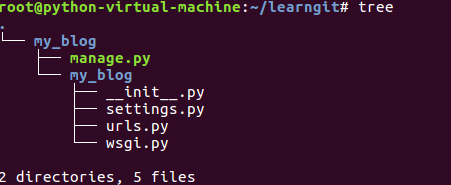
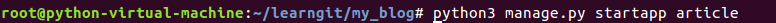
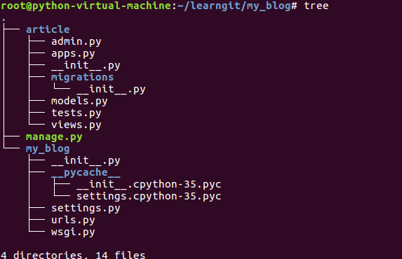
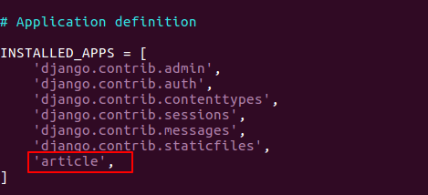
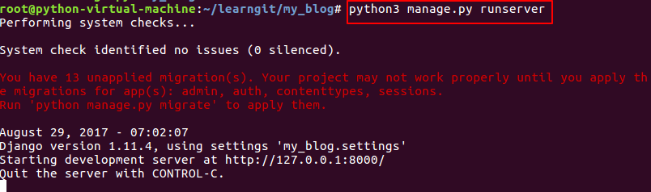
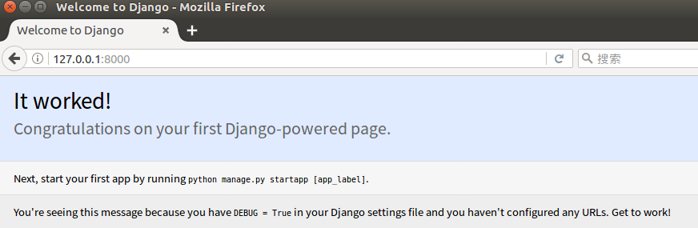

# 项目与APP
## 项目创建

现在正式开始吧, 我们创建一个名为`my_blog`的Django项目

**创建项目的指令如下:**

现在来看一下整个项目的文件结构

## 建立Django app
> 
在Django中的app我认为就是一个功能模块, 与其他的web框架可能有很大的区别, 将不能功能放在不同的app中, 方便代码的复用

建立一个`article` app,进入my_blog目录执行下面的代码

现在让我们重新看一下整个项目的结构

并在my_blog/my_blog/setting.py下添加新建app

## 运行程序
返回my_blog目录执行

现在可以启动浏览器, 输入`http://127.0.0.1:8000/`, 当出现

说明你成功走出了第一步!

