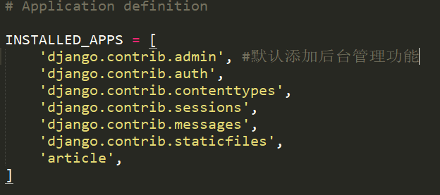
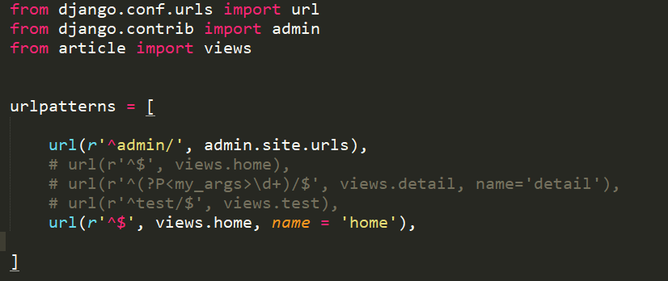
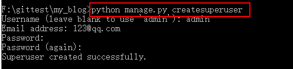
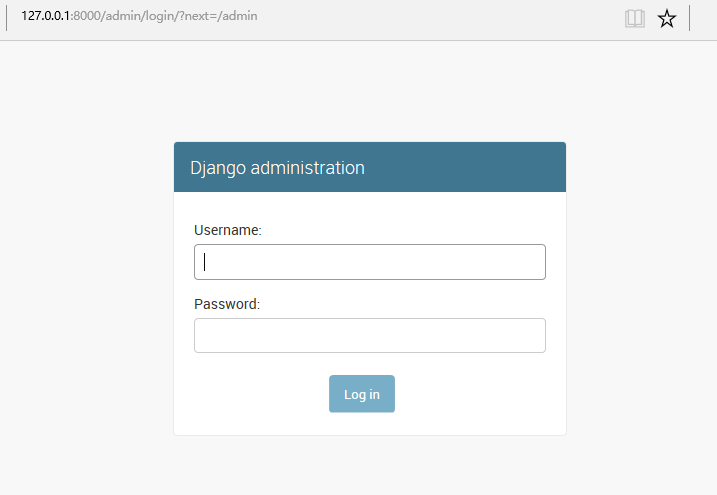
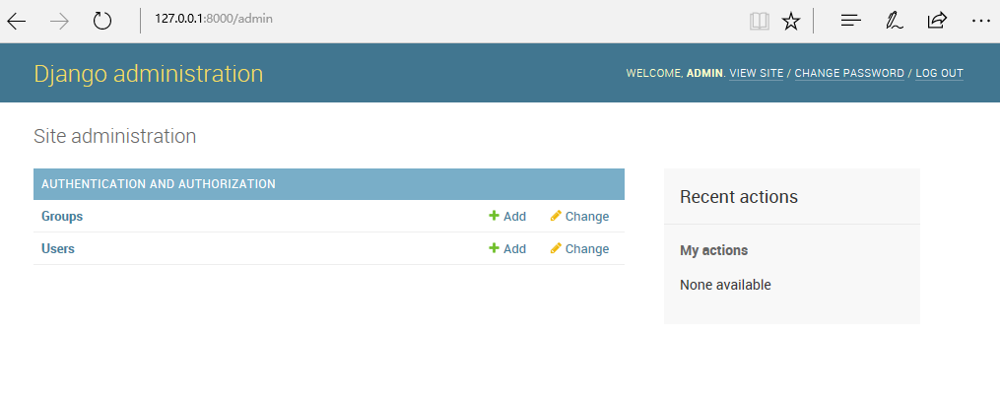
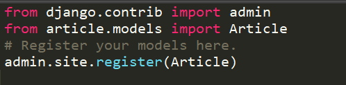
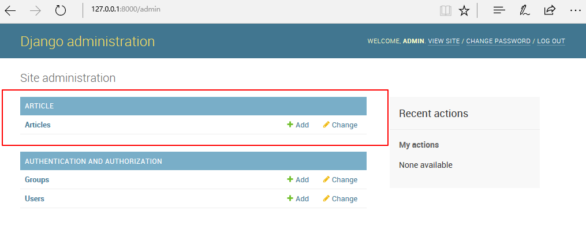
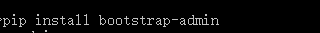
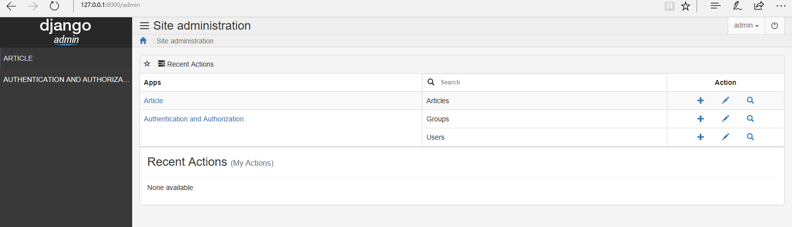

# Admin

**Admin简介**

Django有一个优秀的特性, 内置了Django admin后台管理界面, 方便管理者进行添加和删除网站的内容.

**设置Admin**
> 新建的项目系统已经为我们设置好了后台管理功能

可以在my_blog/my_blog/setting.py中查看

同时也已经添加了进入后天管理的url, 可以在my_blog/my_blog/urls.py中查看

使用如下命令账号创建超级用户(如果使用了python manage.py syncdb会要求你创建一个超级用户)

输入用户名, 邮箱, 密码就能够创建一个超级用户 现在可以在浏览器中输入[127.0.0.1:8000/admin][1]输入账户和密码进入后台管理, 如下:

但是你会发现并没有数据库信息的增加和删除, 现在我们在my_blog/article/admin.py中增加代码:

保存后, 再次刷新页面, `127.0.0.1:8000/admin`

对于管理界面的外观的定制还有展示顺序的修改就不详细叙述了, 感兴趣的可以查看官方文档...

**使用第三方插件**

尝试使用django-admin-bootstrap美化后台管理界面

**安装**

**配置**
然后在my_blog/my_blog/setting.py中修改`INSTALLED_APPS`

