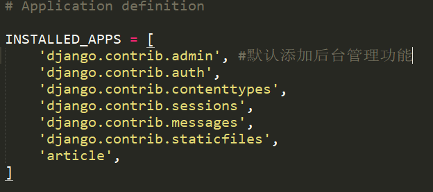
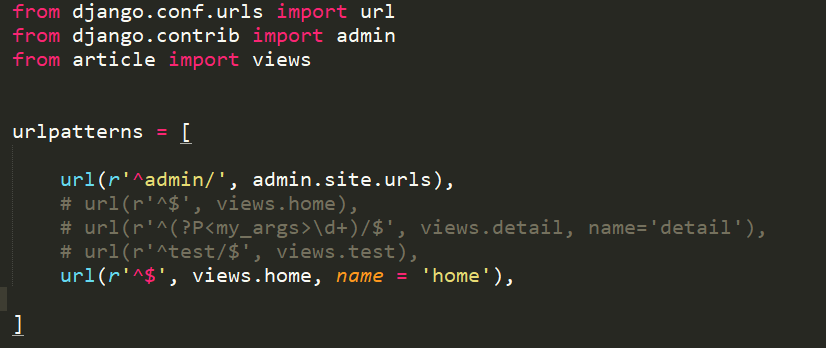

# Admin

**Admin简介**

Django有一个优秀的特性, 内置了Django admin后台管理界面, 方便管理者进行添加和删除网站的内容.

**设置Admin**
> 新建的项目系统已经为我们设置好了后台管理功能

可以在my_blog/my_blog/setting.py中查看

同时也已经添加了进入后天管理的url, 可以在my_blog/my_blog/urls.py中查看

