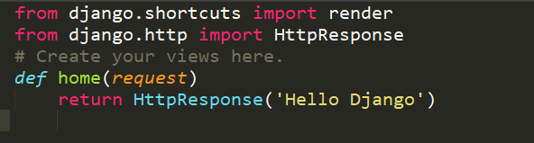

# Views和URL

**网页程序的逻辑**

> request进来->从服务器获取数据->处理数据->把网页呈现出来

* `url`设置相当于客户端向服务器发出request请求的入口, 并用来指明要调用的程序逻辑
* `views`用来处理程序逻辑, 然后呈现到template(一般为`GET`方法, `POST`方法略有不同)
* `template`一般为html+CSS的形式, 主要是呈现给用户的表现形式

**简单Django Views和URL**

Django中views里面的代码就是一个一个函数逻辑, 处理客户端(浏览器)发送的HTTPRequest, 然后返回HTTPResponse,
那么那么开始在my_blog/article/views.py中编写简单的逻辑

那么如何使这个逻辑在http请求进入时, 被调用呢, 这里需要在`my_blog/my_blog/urls.py`中进行url设置