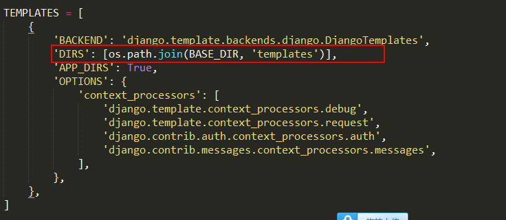
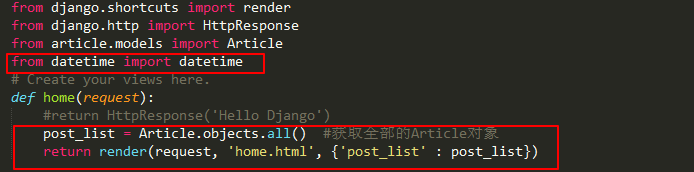
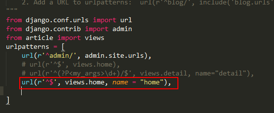
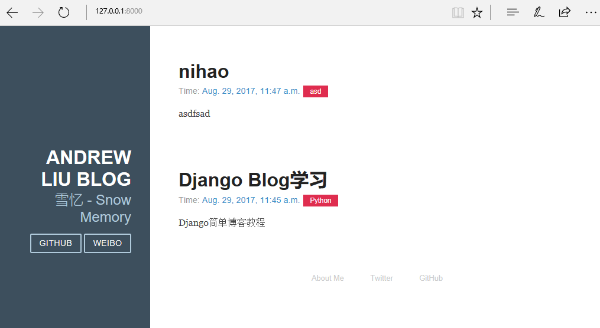

# Template
在my_blog下添加文件名, 文件夹名为templates
```
makdir templates
```

在my_blog/my_blog/setting.py下设置templates的位置



意思是告知项目templates文件夹在项目根目录下

**正式编写template**

在template文件夹下增加base.html, 并在其中增加如下代码

```
<!doctype html>
<html lang="en">
<head>
    <meta charset="utf-8">
<meta name="viewport" content="width=device-width, initial-scale=1.0">
<meta name="description" content="A layout example that shows off a blog page with a list of posts.">

    <title>Andrew Liu Blog</title>
    <link rel="stylesheet" href="http://yui.yahooapis.com/pure/0.5.0/pure-min.css">
    <link rel="stylesheet" href="http://yui.yahooapis.com/pure/0.5.0/grids-responsive-min.css">
    <link rel="stylesheet" href="http://picturebag.qiniudn.com/blog.css">
</head>
<body>
<div id="layout" class="pure-g">
    <div class="sidebar pure-u-1 pure-u-md-1-4">
        <div class="header">
            <h1 class="brand-title">Andrew Liu Blog</h1>
            <h2 class="brand-tagline">雪忆 - Snow Memory</h2>
            <nav class="nav">
                <ul class="nav-list">
                    <li class="nav-item">
                        <a class="pure-button" href="https://github.com/Andrew-liu">Github</a>
                    </li>
                    <li class="nav-item">
                        <a class="pure-button" href="http://weibo.com/dinosaurliu">Weibo</a>
                    </li>
                </ul>
            </nav>
        </div>
    </div>

    <div class="content pure-u-1 pure-u-md-3-4">
        <div>
            
            
            <div class="footer">
                <div class="pure-menu pure-menu-horizontal pure-menu-open">
                    <ul>
                        <li><a href="http://andrewliu.tk/about/">About Me</a></li>
                        <li><a href="http://twitter.com/yuilibrary/">Twitter</a></li>
                        <li><a href="http://github.com/yahoo/pure/">GitHub</a></li>
                    </ul>
                </div>
            </div>
        </div>
    </div>
</div>

</body>
</html>
```

上面这段html编写的页面是一个模板, 其中 字段用来被其他继承这个基类模板进行重写

我们继续在templates文件夹下添加home.html文件

```



<div class="posts">
    
        <section class="post">
            <header class="post-header">
                <h2 class="post-title">{{ post.title }}</h2>

                    <p class="post-meta">
                        Time:  <a class="post-author" href="#">{{ post.date_time }}</a> <a class="post-category post-category-js" href="#">{{ post.category }}</a>
                    </p>
            </header>

                <div class="post-description">
                    <p>
                        {{ post.content }}
                    </p>
                </div>
        </section>
    
</div><!-- /.blog-post -->

```
其中
* 与成对存在, 这是template中提供的for循环tag
*   是template中提供的if语句tag
* template中还提供了一些过滤器

然后修改my_blog/article/view.py



修改my_blog/my_blog/urls.py



现在重新打开http://127.0.0.1:8000/, 发现Blog的整理框架已经基本完成, 到现在我们已经了解了一些Django的基本知识, 搭建了简单地Blog框架, 剩下的就是给Blog添加功能



**将代码上传到Github**

在github中新建仓库`my_blog_tutorial`, 填写简单的描述

```
 #查看当前目录位置
    $ pwd
    /Users/andrew_liu/Python/Django/my_blog

    #在项目的根目录下初始化git
    git init
    Initialized empty Git repository in/Users/andrew_liu/Python/Django/my_blog/.git/

    #添加远程github
    $ git remote add blog git@github.com:Andrew-liu/my_blog_tutorial.git
```

在根目录下增加`.gitignore'和'LICENSE'和'README.md'文件

```
#添加所有文件
    $ git add .

    #查看当前状态
    $ git status

    #commit操作
    $ git commit -m "django tutorial init"

    #上传github
    $ git push -u blog master
    Counting objects: 23, done.
    Delta compression using up to 4 threads.
    Compressing objects: 100% (22/22), done.
    Writing objects: 100% (23/23), 19.56 KiB | 0 bytes/s, done.
    Total 23 (delta 1), reused 0 (delta 0)
    To git@github.com:Andrew-liu/my_blog_tutorial.git
     * [new branch]      master -> master
    Branch master set up to track remote branch master from blog.
```