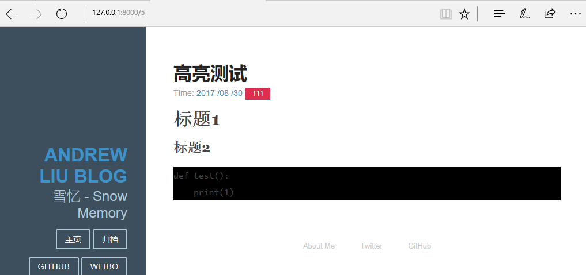

# markdown和代码高亮

**markdown你的博文**

`markdown`越来越流行, 越来越多的写博客的博主都喜欢上了makrdown这种标记性语言的易用性和美观性. 像`简书`, `作业部落`, `Mou`都是比较出名的markdown在线或者离线形式

现在我们就来markdown自己的博客吗, 首先是安装`markdown`库, 使用下面命令

```
 #首先是安装markdown
 $ pip install markdown  #记得激活虚拟环境
```
现在说说怎么markdown你的博文, 在article下建立新文件夹`templatetags`,然后我们来定义的自己的 template filter, 然后在templatetags中建立`__init__.py`, 让文件夹可以被看做一个包, 然后在文件夹中新建`custom_markdown.py`文件, 添加代码


```
 import markdown

    from django import template
    from django.template.defaultfilters import stringfilter
    from django.utils.encoding import force_text
    from django.utils.safestring import mark_safe

    register = template.Library()  #自定义filter时必须加上

    @register.filter(is_safe=True)  #注册template filter
    @stringfilter  #希望字符串作为参数
    def custom_markdown(value):
        return mark_safe(markdown.markdown(value,
            extensions = ['markdown.extensions.fenced_code', 'markdown.extensions.codehilite'],
                                           safe_mode=True,
                                           enable_attributes=False))
```

然后只需要对需要进行markdown化的地方进行简单的修改,

```




<div class="posts">
        <section class="post">
            <header class="post-header">
                <h2 class="post-title">{{ post.title }}</h2>

                    <p class="post-meta">
                        Time:  <a class="post-author" href="#">{{ post.date_time|date:'Y /m /d'}}</a> <a class="post-category post-category-js" href="">{{ post.category }}</a>
                    </p>
            </header>

                <div class="post-description">
                    <p>
                        {{ post.content|custom_markdown }}
                    </p>
                </div>
        </section>
        
</div><!-- /.blog-post -->

```

``添加自定义的filter, 然后使用filter的方式为`{{ post.content|custom_markdown }}`, 只需要对需要使用markdown格式的文本添加管道然后再添加一个自定义filter就好了.
现在启动web服务器, 在浏览器中输入, 可以看到全新的的markdown效果

**代码高亮**

这里代码高亮使用一个CSS文件导入到网页中就可以实现了, 因为在上面写`markdown`的`filter`中已经添加了扩展高亮的功能, 所以现在只要下载CSS文件就好了.

在pygments找到你想要的代码主题, 我比较喜欢monokai, 然后在pygments-css下载你喜欢的CSS主题, 然后加入当博客目录的static目录下, 或者最简单的直接上传七牛进行CDN加速

修改base.html的头部

```
<!doctype html>
<html lang="en">
<head>
    <meta charset="utf-8">
<meta name="viewport" content="width=device-width, initial-scale=1.0">
<meta name="description" content="A layout example that shows off a blog page with a list of posts.">

    <title> Andrew Liu Blog </title>
    <link rel="stylesheet" href="http://yui.yahooapis.com/pure/0.5.0/pure-min.css">
    <link rel="stylesheet" href="http://yui.yahooapis.com/pure/0.5.0/grids-responsive-min.css">
    <link rel="stylesheet" href="http://picturebag.qiniudn.com/blog.css">
    <link rel="stylesheet" href="http://picturebag.qiniudn.com/monokai.css">
</head>  
```

`<link rel="stylesheet" href="http://picturebag.qiniudn.com/monokai.css">`添加CSS样式到base.html就可以了.">

现在启动web服务器, 添加一个带有markdown样式的代码的文章, 就能看到效果了, 在浏览器中输入http://127.0.0.1:8000/



