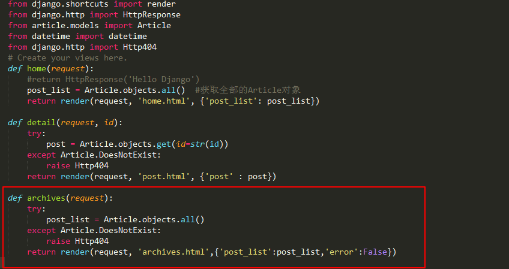
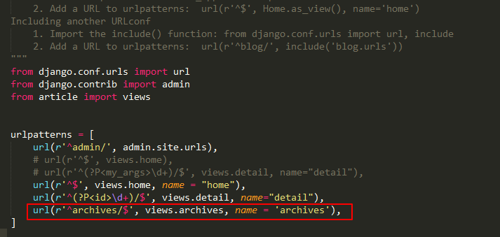
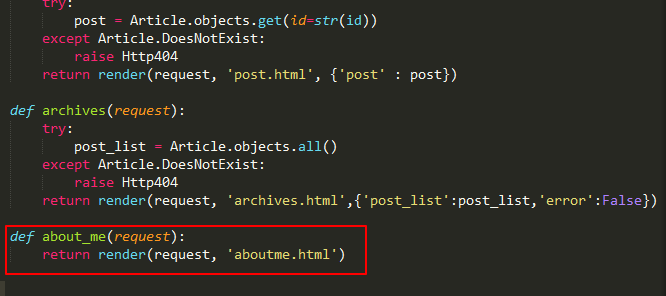
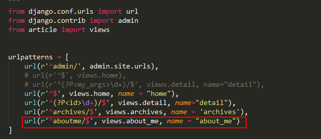
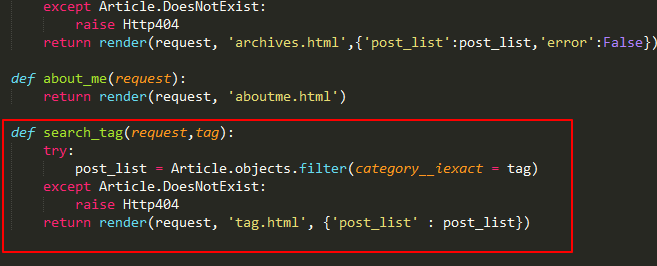

# 归档, AboutMe和标签分类

> 这一章节说的东西都是一些知识回顾,

**归档**

归档就是列出当前博客中所有的文章, 并且能够显示时间, 很容易的可以写出对应的view和模板来

在app的view添加归档功能




在my_blog/templates新建模板archives.html

```



<div class="posts">
    
        <section class="post">
            <header class="post-header">
                <h2 class="post-title"><a href="">{{ post.title }}</a></h2>

                    <p class="post-meta">
                        Time:  <a class="post-author" href="#">{{ post.date_time |date:'Y /m /d'}}</a> <a class="post-category post-category-js" href="">{{ post.category }}</a>
                    </p>
            </header>
        </section>
    
</div><!-- /.blog-post -->

```

并在my_blog/my_blog/usls.py中添加对应url配置




** AboutMe **

在my_blog/article/view.py下添加新的逻辑




新建模板aboutme.html, 内容如下, 大家可以自定义自己喜欢的简介

```




<div class="posts">
        <p> About Me 正在建设中 </p>
</div><!-- /.blog-post -->

```
并在my_blog/my_blog/usls.py中添加对应url配置




**标签分类**

实现功能: 点击对应的标签按钮, 会跳转到一个新的页面, 这个页面是所有相关标签的文章的罗列

只需要在在view.py下添加新的逻辑



可以看成是对tag的查询操作, 通过传入对应点击的tag, 然后对tag进行查询

在对应的有tag的html网页中修改代码

```




<div class="posts">
    
        <section class="post">
            <header class="post-header">
                <h2 class="post-title"><a href="">{{ post.title }}</a></h2>

                    <p class="post-meta">
                        Time:  <a class="post-author" href="#">{{ post.date_time |date:'Y M d'}}</a> <a class="post-category post-category-js" href="">{{ post.category|title }}</a>
                    </p>
            </header>

                <div class="post-description">
                    <p>
                        {{ post.content|custom_markdown }}
                    </p>
                </div>
                <a class="pure-button" href="">Read More >>> </a>
        </section>
    
</div><!-- /.blog-post -->

```

仔细看这一句{{ post.category|title }}. 其中标签对超链接已经发生改变, 这是在对标签就行点击时, 会将标签作为参数, 传入到对应的view中执行逻辑, 然后进行网页跳转...

并在my_blog/my_blog/usls.py中添加对应url配置
```
from django.conf.urls import url
from django.contrib import admin
from article import views


urlpatterns = [
    url(r'^admin/', admin.site.urls),
    # url(r'^$', views.home),
    # url(r'^(?P<my_args>\d+)/$', views.detail, name="detail"),
    url(r'^$', views.home, name = "home"),
    url(r'^(?P<id>\d+)/$', views.detail, name="detail"),
    url(r'^archives/$', views.archives, name = 'archives'),
    url(r'^aboutme/$', views.about_me, name = "about_me"),
    url(r'^tag(?P<tag>\w+)/$', views.search_tag, name = 'search_tag'),
]

```

现在在浏览器中输入http://127.0.0.1:8000/, 点击对应的归档或者ABOUT ME 或者标签按钮可以看到对应的效果 


